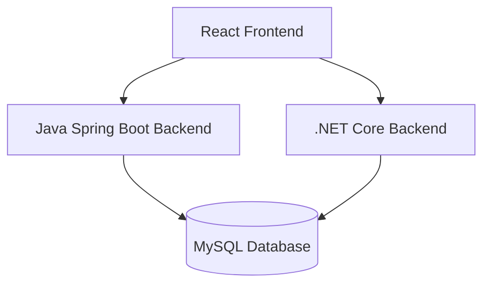

# Computer-Seekho

Computer-Seekho is a comprehensive Student Management System designed for educational institutions. It serves as a learning resource by providing a real-world project structure with multiple backend implementations.


## Architecture

The project follows a decoupled architecture with a standalone React frontend and two alternative backend implementations.




## Project Structure

```

Computer-Seekho/
│
├── .metadata/              # Project metadata and configuration files
├── DotNet-backend/         # Backend implementation using .NET 8
├── java-backend/           # Backend implementation using Java 17 / Spring Boot
├── frontend/               # Frontend application (React 19 / Vite)
└── README.md               # Project documentation

```

Each folder represents a different technology stack to demonstrate multiple development approaches.


##  Features

- **Student Management**: Registration, course enrollment, and payment tracking.
- **Course & Batch Management**: Handling various courses and scheduled batches.
- **Enquiry System**: Tracking public enquiries and follow-ups.
- **Reporting**: Generating Excel and PDF reports for payments and admissions.
- **Media Management**: Album/Gallery system for images and videos.
- **Internationalization (i18n)**: Support for multiple languages.
- **Staff Portal**: Admin dashboard for staff to manage day-to-day operations.


##  Technologies Used

### Frontend
- **Framework**: React 19 (Vite)
- **UI Library**: Bootstrap 5 & React-Bootstrap
- **Routing**: React Router Dom
- **Authentication**: JWT & Google OAuth
- **API Client**: Axios

### Backends
The project demonstrates identical business logic across two popular stacks:

| Feature | Java Backend | .NET Backend |
| :--- | :--- | :--- |
| **Framework** | Spring Boot 4.x | .NET 8.0 |
| **Language** | Java 17 | C# |
| **ORM** | Spring Data JPA | Entity Framework Core |
| **Database** | MySQL | MySQL |
| **Security** | Spring Security + JWT | ASP.NET Core Identity + JWT |
| **Email** | Spring Boot Mail | MailKit |
| **Reports** | iText (PDF), Apache POI (Excel) | iText7 (PDF), NPOI (Excel) |


##  Getting Started

### Prerequisites
Ensure you have the following installed:
- **Java 17** (for Java backend)
- **.NET 8.0 SDK** (for .NET backend)
- **Node.js (v18+)** & **npm** (for frontend)
- **MySQL Server 8.0**

### 1. Database Setup
1. Open your MySQL terminal or workbench.
2. Create a database named `computerseekhoapp`:
   ```sql
   CREATE DATABASE computerseekhoapp;
   ```
3. The tables will be automatically generated by the backends on the first run.

### 2. Backend Setup (Choose One)

#### Java Spring Boot
1. Navigate to the `java-backend` folder.
2. Update `src/main/resources/application.properties` with your MySQL credentials.
3. Run the application:
   ```bash
   ./mvnw spring-boot:run
   ```

#### .NET Core
1. Navigate to the `DotNet-backend/ComputerSeekho.Net` folder.
2. Update `appsettings.json` with your MySQL connection string.
3. Run the application:
   ```bash
   dotnet run
   ```

### 3. Frontend Setup
1. Navigate to the `frontend` folder.
2. Install dependencies:
   ```bash
   npm install
   ```
3. Start the development server:
   ```bash
   npm run dev
   ```
4. Access the app at `http://localhost:5173`.


## Configuration Notes

> [!IMPORTANT]
> **Image Uploads**: Both backends expect a path to the frontend's `public/images` directory. Update the `app.image.upload-dir` (Java) or `App:ImageUploadDir` (.NET) setting to match your local path.

> [!TIP]
> **Email**: Email features require a valid SMTP configuration. Update the mail settings in `application.properties` or `appsettings.json` with your credentials or use a test service like Mailtrap.


##  Learning Objectives

This repository helps you learn:

* How real-world projects are structured
* Differences between Java and .NET backends
* Frontend and backend integration
* Best practices in organizing codebases


##  License

This project is licensed under the **MIT Licens**.

